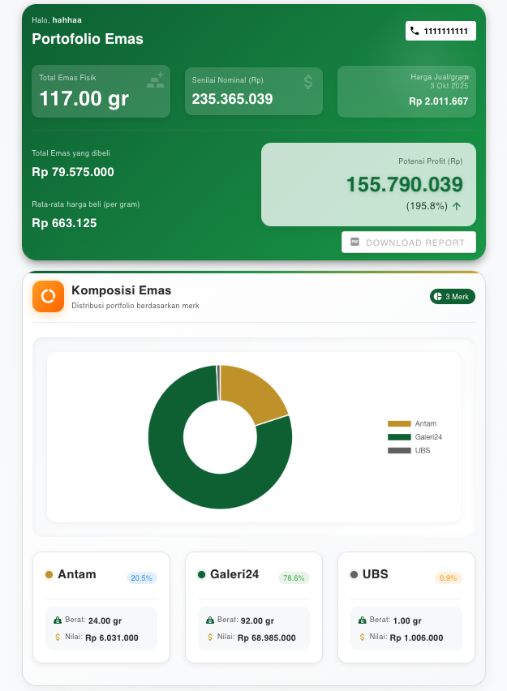

# Gold Insight 🏆

<p align="center">
  
</p>

<!--  -->

**Gold Insight** adalah aplikasi web modern berbasis **Vue 3** + **Vuetify** untuk mengelola dan menganalisis portofolio emas fisik. Dilengkapi dengan dashboard interaktif, grafik harian, dan integrasi ke  (supabase) untuk pengalaman pengelolaan investasi emas fisik.

## ✨ Fitur Utama

### 🔐 Autentikasi & Data
- **Login Nasabah** - Autentikasi dengan nama & no HP
- **Cloud Storage** - Semua data tersimpan aman di Supabase
- **Real-time Sync** - Data tersinkronisasi otomatis

### 📊 Dashboard & Analytics
- **Portfolio Summary** - Total emas, nilai portfolio, rata-rata harga
- **Profit Calculator** - Hitung potensi profit secara otomatis
- **Visual Charts** - Donut chart komposisi & line chart harga historis
- **Price Tracking** - Harga emas update otomatis dari database

### 💼 Transaction Management
- **Tambah Transaksi** - Input transaksi beli/jual dengan mudah
- **Auto-fill Prices** - Harga otomatis terisi, bisa edit manual
- **Transaction History** - Riwayat lengkap dengan filter dan sort
- **Delete Transactions** - Hapus transaksi dengan konfirmasi

### 📑 Reporting
- **PDF Export** - Download laporan portfolio lengkap
- **Auto-naming** - Format: `report_portfolio_emas_{nohp}_{tgl}_{seq}.pdf`
- **Comprehensive Report** - Termasuk chart, komposisi, dan riwayat
- **Quick Download** - Tombol download muncul setelah isi feedback

### 🎨 UI/UX Enhancements
- **Modern Design** - Gradient backgrounds, smooth animations
- **Responsive Layout** - Perfect di desktop, tablet, dan mobile
- **Interactive Elements** - Hover effects, loading states, transitions
- **Smooth Animations** - 15+ custom keyframe animations
- **Mobile-first** - Touch-friendly dengan optimized layouts

### 🔔 User Experience
- **Welcome Banner** - Greeting banner dengan auto-dismiss
- **Back-to-top Button** - Smooth scroll ke atas halaman
- **Empty States** - Informative messages saat data kosong
- **Loading Indicators** - Visual feedback untuk setiap action
- **Feedback System** - Integrated Google Form untuk user feedback

## 🚀 Quick Start

### Prerequisites
- Node.js 16+ 
- npm atau yarn

### Installation

1. **Clone repository:**
   ```bash
   git clone <repository-url>
   cd goldins
   ```

2. **Install dependencies:**
   ```bash
   npm install
   ```

3. **Setup Environment:**
   
   Buat file `.env` dan tambahkan Supabase credentials:
   ```env
   VITE_SUPABASE_URL=your_supabase_url
   VITE_SUPABASE_ANON_KEY=your_supabase_key
   ```

4. **Jalankan development server:**
   ```bash
   npm run dev
   ```

5. **Buka di browser:**
   
   Kunjungi [http://localhost:5173](http://localhost:5173)

### Build untuk Production

```bash
npm run build
```

Output akan tersimpan di folder `dist/`

## 📁 Struktur Proyek

```
goldins/
├── src/
│   ├── App.vue                      # Main application shell
│   ├── main.js                      # Application entry point
│   ├── style.css                    # Global styles
│   ├── assets/                      # Images & static files
│   │   ├── onboarding1.png         # Carousel image 1
│   │   ├── onboarding2.png         # Carousel image 2
│   │   ├── onboarding3.png         # Carousel image 3
│   │   └── ss_v2.png               # Screenshot
│   ├── components/                  # Vue components
│   │   ├── Dashboard.vue           # Main dashboard
│   │   ├── PortfolioSummary.vue    # Portfolio overview
│   │   ├── GoldComposition.vue     # Donut chart composition
│   │   ├── GoldPriceChart.vue      # Line chart price history
│   │   ├── TransactionForm.vue     # Add transaction form
│   │   ├── TransactionHistory.vue  # Transaction list
│   │   └── AppFeedback.vue         # Feedback section
│   └── lib/
│       └── SupabaseClient.js       # Supabase configuration
├── api/
│   └── prices.js                    # Vercel serverless function
├── vite.config.js                   # Vite configuration
├── vercel.json                      # Vercel deployment config
└── package.json                     # Dependencies
```

## 🎨 Tech Stack

### Frontend
- **Vue 3** - Progressive JavaScript framework
- **Vuetify 3** - Material Design component framework
- **Chart.js** - Interactive charts and graphs
- **Vite** - Next-generation frontend tooling
- **jsPDF** - PDF generation library
- **html2canvas** - Screenshot HTML elements

### Backend & Database
- **Supabase** - Backend-as-a-Service
  - PostgreSQL database
  - Authentication
  - Row Level Security

### Deployment
- **Vercel** - Serverless deployment platform
  - Edge functions for API proxy
  - Automatic SSL
  - Global CDN

## 🗃️ Database Schema

### Tables

#### `users`
```sql
- phone (varchar, primary key)
- name (varchar)
- created_at (timestamp)
```

#### `transactions`
```sql
- id (bigint, primary key)
- user_phone (varchar, foreign key)
- type (varchar)
- brand (varchar) 
- denom (numeric) 
- count (integer)
- date (date)
- price (numeric)
- total_price (numeric)
- created_at (timestamp)
```

#### `gold_prices`
```sql
- id (bigint, primary key)
- brand (varchar)
- denom (numeric)
- date (date)
- price_buyback (numeric) - Selling price
- price_sell (numeric) - Buying price
- created_at (timestamp)
```

## 🎯 Key Features Explained

### 1. Smart Price System
- Harga emas diambil dari database `gold_prices`
- Auto-fill berdasarkan merk, denominasi, dan tanggal
- User bisa override dengan harga manual
- Validasi otomatis untuk transaksi jual (cek saldo)

### 2. Real-time Portfolio Calculation
- **Total Emas**: Sum dari (denom × count) untuk transaksi beli - jual
- **Senilai**: Total emas × latest price
- **Avg Harga Beli**: Sum(total_price) ÷ Sum(gram) dari transaksi beli
- **Potensi Profit**: (Latest price - Avg buy price) × Total gram

### 3. Chart Visualization
- **Donut Chart**: Komposisi portfolio per brand dengan persentase
- **Line Chart**: Trend harga 7 hari terakhir per brand & denomination
- **Price Stats**: Highest & lowest price dari data chart

### 4. PDF Report Generation
- Capture donut chart sebagai image (html2canvas)
- Generate multi-section PDF dengan jsPDF
- Auto-naming: `report_portfolio_emas_{phone}_{date}_{sequence}.pdf`
- Sections: Portfolio summary, composition, transaction history

### 5. Enhanced UX Flow
- **Feedback → Download**: Tombol download muncul 3 detik setelah klik feedback
- **No Scroll Needed**: Download button contextual di lokasi feedback
- **Smooth Animations**: 15+ custom CSS animations untuk transitions
- **Loading States**: Visual feedback untuk setiap async operation

## 🎨 Animation Library

Aplikasi menggunakan custom CSS animations:

- `fadeInUp` - Card entrance from bottom
- `slideInLeft/Right` - Horizontal entrance
- `fadeInScale` - Zoom in with fade
- `pulse` - Continuous breathing effect
- `bounce` - Profit arrow bounce
- `shimmer` - Gradient shimmer effect
- `chartZoom` - Chart appear animation
- `slide-fade` - Download button entrance
- ... dan banyak lagi!

## 🧪 Testing

### Manual Testing Checklist

- [x] Login dengan phone number baru
- [x] Tambah transaksi beli
- [x] Tambah transaksi jual (validasi saldo)
- [x] Lihat portfolio summary update
- [x] Check donut chart composition
- [x] Check line chart price history
- [x] Filter chart by brand & denomination
- [x] Delete transaction
- [x] Click feedback button
- [x] Wait 3s and check download button appears
- [x] Download PDF report
- [x] Test on mobile device
- [x] Test on different browsers

### Browser Compatibility

| Browser | Version | Status |
|---------|---------|--------|
| Chrome  | 90+     | ✅ Tested |
| Firefox | 88+     | ✅ Tested |
| Safari  | 14+     | ✅ Tested |
| Edge    | 90+     | ✅ Tested |
| Mobile Safari | 14+ | ✅ Tested |
| Chrome Android | 90+ | ✅ Tested |

## 🚀 Deployment

### Deploy to Vercel

1. **Install Vercel CLI:**
   ```bash
   npm install -g vercel
   ```

2. **Login:**
   ```bash
   vercel login
   ```

3. **Deploy:**
   ```bash
   vercel --prod
   ```

4. **Set Environment Variables:**
   
   Di Vercel dashboard, tambahkan:
   - `VITE_SUPABASE_URL`
   - `VITE_SUPABASE_ANON_KEY`

### Auto Deploy with Git

Connect repository ke Vercel untuk automatic deployment:
- Push to `main` → Production deployment
- Push to branch → Preview deployment

## 💡 Tips & Best Practices

### Performance
- Images di-optimize dengan Vite
- Lazy loading untuk components
- CSS animations hardware-accelerated (transform/opacity)
- Minimal re-renders dengan computed properties

### Security
- Supabase Row Level Security enabled
- API keys di environment variables
- XSS protection dengan Vue's template sanitization
- HTTPS enforced via Vercel

### Accessibility
- Semantic HTML elements
- ARIA labels untuk screen readers
- Keyboard navigation support
- Sufficient color contrast ratios
- Touch-friendly tap targets (min 44x44px)

## 📄 License

This project is licensed under the MIT License.

## 👨‍💻 Author

Built with ❤️ using Vue 3, Vuetify, Chart.js, Supabase, and Vercel.

## 🙏 Acknowledgments

- **Vuetify Team** - Amazing Material Design components
- **Supabase** - Powerful Backend-as-a-Service
- **Vercel** - Seamless deployment platform
- **Chart.js** - Beautiful interactive charts
- **Vue.js Community** - Helpful resources and support

---

**Version**: 2.0  
**Last Updated**: October 2025
**Status**: ✅ Production Ready
